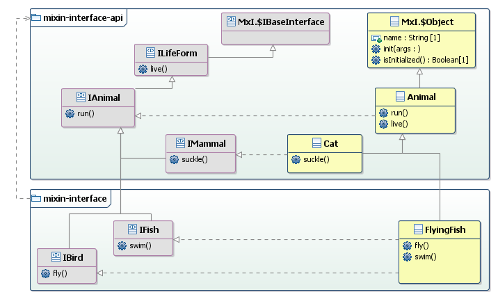

# mixin-interface

Extension of 'mixin-interface-api' which provides a _deprecated_ implementation of the _Log feature_ (e.g. `MxI.$System.log()`).

## Release 4.9.0 changelog
This release deprecates the previous _Log feature_ implementation (`MxI.$System`). This release moves the implementation of _Log feature_ in `mixin-interface-api`. It is much better and modern thanks to the _sink metaphor_. 
 >This idea is neither new nor mine but I thought that it would be very nice to have. You're welcome to read [this article](http://tutorials.jenkov.com/api-design/avoid-logging.html) and take a look at the [Serilog library](https://serilog.net/).

Now the _Log client_ sends a _trace request_ (`MxI.$Log.write()`), then the _trace message_ is eventually processed by being sent to a specific _target_ (e.g. _Console_, _File_, _Server_, _Database_, etc...). 
The _sink(s)_ must be explicitly declared (`MxI.$Log.addSink()`) else the _trace request_ is not processed.  
 >Notice that _sink_ classes must implement `MxI.$ILogSink` but they are no more singletons.  

* Major refactoring of _Log API_: step 1/2 - move some classes from `mixin-interface` to `mixin-interface-api`
  * `MxI.$ILogger` interface moved and rename to `MxI.$LogSink`.
  * `MxI.$DefaultLogger` implementation moved and renamed to `MxI.$ConsoleLogSink`.   
  * Implementation of _Log feature_ moved from `MxI.$System` class to `MxI.$Log` class. Please notice that the previous API (e.g. `MxI.$System.log()`) is still supported but is now _deprecated_.  
<br> 
* Major refactoring of _Log API_: step 2/2 - New implementation classes in `mixin-interface-api`
  * `MxI.$Log` is the new implementation of the _Log feature_ in which _trace requests_ are processed by _sink(s)_. A _sink_ redirects traces (`MxI.$Log.write()` calls) to specific target (e.g. `$ConsoleLogSink` redirects to the console). 
  * `MxI.$FileLogSink` is a _sink_ which redirects traces (`MxI.$Log.write()` calls) to a file (e.g. `log.txt`)
___
## Release 4.7.5 changelog
* Documentation upgrade 1/2: UML model diagram for the implementation sample
* Documentation upgrade 2/2: Paragraphs reordering ( _Sample UML Model_, _Core API Reference_ and _Extended API Reference_ now before _Installation and Usage_ and _How to run the Unit Test_)

## Sample UML Model


## Howto: _FlyingFish_ implementation class
Here is an example of how to subclass an _implementation class_ (see [`./src/test_classes/flying_fish.js`](https://github.com/Echopraxium/mixin-interface/blob/master/src/test_classes/flying_fish.js)). Please find below how to subclass `Animal` and implement the `IBird` and `IFish` _interface classes_ as well.

* Subclass `Animal` (from `mixin-interface-api`) by means of the `MxI.Implementation().$with()` _idiom_ (after `extends` to define both a subclass and the _interfaces_ that it implements).
* Provide implementation of the service defined by `IBird` (fly()) and `IFish` (swim()). If a service from the parent _interface(s)_ is not provided then it may be inherited from the parent _implementation class_.

 >Notice this is the case in the following sample: for `run()` an `live()`, as they are _disabled_ by the `__` prefix then it is the implementation from the parent class which is inherited instead.

* Add the `MxI.$setClass(Cat).$asImplementationOf(IBird, IFish)` _idiom_ just after the class definition. 

 >This is required so that `MxI.$isInstanceOf()` works properly to identify an object both as being an instance of an _implementation class_ (and its superclass(es)) as well being an instance of an _interface class_ (and its superclass(es)).

```javascript
const MxI     = require('../mixin_interface.js').MxI;
const Animal  = require('mixin-interface-api/src/test_classes/animal.js').Animal;
const IAnimal = require('mixin-interface-api/src/test_classes/i_animal.js').IAnimal;
const IBird   = require('./i_bird.js').IBird;
const IFish   = require('./i_fish.js').IFish;

class FlyingFish extends MxI.$Implementation(Animal).$with(IBird, IFish) {
  constructor() {
    super();
  } // 'FlyingFish' constructor

  fly() {
    MxI.$Log.write('--> FlyingFish.fly');
  } // IBird.fly()

  swim() {
    MxI.$Log.write('--> FlyingFish.swim');
  } // IFish.swim()

  __run() {
    MxI.$Log.write('--> FlyingFish.run');
  } // IAnimal.run()

  __live() {
    MxI.$Log.write('--> FlyingFish.live');
  } // ILifeForm.live()
} // 'FlyingFish' class
MxI.$setClass(FlyingFish).$asImplementationOf(IBird, IFish);
exports.FlyingFish = FlyingFish;
```
>Notice that `IAnimal.run()` and `ILifeForm.live()` services are not provided, so they are inherited from the parent _implementation class_ (`Animal`).
<br><br>

# API Reference - Foreword

Please note the following keywords and their meaning: 
  
> **API service**: _function provided by 'mixin-interface'_ (e.g. `Mxi.$isInstanceOf()`)  
> **MxI**: _namespace_ for all the _mixin-interface_ API services  
> **object**: for _instance of an _implementation class_   
> **service**: for _function defined by an interface class_ (e.g. `IAnimal.run()`)   
> **type**: for either an _implementation class_ (e.g. `Animal`) or an _interface class_ (e.g. `IAnimal`)    
> **interface**: for _interface class_  
> **super_interface**: for _superclass of the interface class_  
> **implementation**: for _implementation class_  
> **super_implementation**: for _superclass of the implementation class_   
> **...interfaces**: _list of implemented interfaces_. The list is provided as _interface class(es)_ separated by a comma (e.g. `ILifeForm` and `IAnimal, ILifeForm` are valid _...interfaces_ arguments) 

# Core API reference (mixin-interface-api) 

For these services please refer to ([mixin-interface-api](https://www.npmjs.com/package/mixin-interface-api)) for their documentation

* **MxI.$isInstanceOf()**: replacement for javascript `instanceof` operator
* **MxI.$isInterface()**: checks if a _type_ is an _interface class_ or not
* **MxI.$implements()**: checks if a _type_ implements an _interface class_ or not
* **MxI.$getSuperclass()**: get the superclass of a a _type
* **MxI.$Interface()**: defines an _interface class_ and its _super_interface_
* **MxI.$setAsInterface().$asChildOf()**: defines that a class is an _interface class_ and its _super_implementation_
 >This is syntactically redundant but nevertheless required in order that `MxI.$isInstanceOf()` works correctly.  
* **MxI.$Implementation().$with()**: defines an _implementation class_ and its superclass (`Mxi.$Object` if no other class applies)
* **MxI.$setClass().$asImplementationOf()**: defines  the _interface class(es)_ implemented by an _implementation class_
* **MxI.$raiseNotImplementedError()**: error handling when a service (defined by of an _interface class_) is not implemented
* **MxI.$Object().init()**: _Delayed Initialization_ feature
* **MxI.$Object().isInitialized()**: checks if an object has been initialized
* **MxI.$ISingleton**: _interface class_ for the _Singleton_ (i.e. Unique instance) design pattern (see [`design-patterns-api`](https://www.npmjs.com/package/design-patterns-api))
* **MxI.$Singleton**: Default _implementation_ for `MxI.$ISingleton` _interface_
* **MxI.$isSingleton()**: Checks if an object is a _Singleton_
* **MxI.$setAsSingleton()**: Required to define that an _implementation_ is a _Singleton_
* **MxI.$INullObject**: _interface class_ for the _Null Object_ design pattern (see [`design-patterns-api`](https://www.npmjs.com/package/design-patterns-api)
* **MxI.$NullObject**: Default _implementation_ for `MxI.$INullObject` _interface_
* **MxI.$Null**: Singleton of `MxI.$NullObject`
* **MxI.$isNull()**: Returns `true` in 2 cases. The first is when the input value is an object which is both a _Null Object_ an a _Singleton_ (typically the 'default Null Object' which is `MxI.$Null`). The second case is when the input value is `undefined`

* **Log Feature**
 >This feature was previously implemented by `MxI.$System` (in `mixin-interface` package). `MxI.$System` still supports the previous implementation but is now _deprecated_.
  * **MxI.$ILogSink**: interface class for a _sink_ (implementation of the Log feature).  
  * **MxI.$Log.write(arg_msg, ...arg_values)**: new implementation of _trace requests_.  
  * **MxI.$Log.banner()**: outputs `arg_msg` within a banner.
  * **MxI.$Log.addSink()**: declares a _sink_ object (which must implement `$ILogSink`).
  * **MxI.$Log.getSinkCount()**: returns the number of _sinks_.   
  * **MxI.$Log.clearSinks()**: deletes all the _sinks_.
  * **MxI.$ConsoleLogSink**: default _sink_ implementation class (sends _trace messages_ to the console).
  * **MxI.$FileLogSink**: default _sink_ implementation class (sends _trace messages_ to a file - e.g. `./log.txt`).

# Extended API Reference (mixin-interface) 
* **MxI.$System.log()**: (_deprecated_, replaced by `MxI.$Log.write`) _Log feature_, more effective and flexible than `console.log()`
* **MxI.$System.banner()**: (_deprecated_, replaced by `MxI.$Log.banner`) a variant of `MxI.$System.log()` which allows "decorated logs" with _banners_
* **MxI.$DefaultLogger**: (_deprecated_) Default implementation of `MxI.$ILogSink`.
* **MxI.$System.setLogger()**: (_deprecated_) Changes the _Logger_ by providing a instance of a class which implements `MxI.$ILogSink`
* **MxI.$System.getLogger()**: (_deprecated_) get the current _LogSink_ (an instance of a class which implements `MxI.$ILogSink`)
* **MxI.$System.resetLogger()**: (_deprecated_) Restores the _Default LogSink_ (`MxI.$DefaultLogger`)


***
## Log Feature Services
Notice that these are _deprecated_ services.  
```javascript
MxI.$DefaultLogger
MxI.$System.log(arg_msg, ...arg_values)
MxI.$System.banner(arg_msg, arg_single_line_banner, arg_separator_char, arg_separator_length)
MxI.$System.setLogger(log_sink)
MxI.$System.resetLogger()
```
* `MxI.$System.log()`: (_deprecated_, replaced by `MxI.$Log.write`) It is more effective and flexible than `console.log()`, like enabling/disabling traces, redirectog to a File or a Stream, define trace levels and categories etc... To use this feature just replace calls to `console.log()` by `MxI.$Log.write()`. 

>A custom _Log sink_ must implement `MxI.$ILogSink` interface, `MxI.$DefaultLogger` is provided as the default implementation of this interface (NB: the implementation class should be a _Singleton_)

* `MxI.$System.setLogger(log_sink)`: sets the current _Log sink_.

>`log_sink` must be an instance of a class which implements `MxI.$ILogSink`
```javascript
const $StarPrefixLogger = require('./src/test_classes/star_prefix_logger.js').$StarPrefixLogger;
MxI.$System.setLogger( new $StarPrefixLogger() );
```

* `MxI.$System.resetLogger()`: restore the default logger (`MxI.$DefaultLogger`):
```javascript
MxI.$System.resetLogger();
```

* `MxI.$System.banner()`: (_deprecated_, replaced by `MxI.$Log.banner`) generates nicer logs by surrounding the message in a banner. Optional arguments (after `arg_msg`) allow to change      
  * the number of lines (3 by default, one if `arg_single_line_banner` is set to `true`)  
  * the separator ('=' by default, another if `arg_separator_char` is set)  
  * the banner size (60 by default, another if `arg_separator_length` is set)  

Example 1:
```bash
MxI.$Log.banner("Unit Test for 'mixin-interface' package");
```
will generate this output:
```
============================================================
========== Unit Test for 'mixin-interface' package =========
============================================================
```

Example 2:
```bash
MxI.$Log.banner("End of Unit Test", true);
```
will generate this output:
```
===================== End of Unit Test =====================
```

Here is the source code of `StarPrefixLogger` (see [`./src/test_classes/star_prefix_logger.js`](https://github.com/Echopraxium/mixin-interface/blob/master/src/test_classes/star_prefix_logger.js)). Once it is set as the current _Log sink_ (with `MxI.$System.setLogger()`), it will add '* ' prefix on each output of `MxI.$System.log()` call (see [`./test.js`](https://github.com/Echopraxium/mixin-interface/blob/master/test.js)).

```javascript
const MxI = require('../mixin_interface.js').MxI;
//============ 'StarPrefixLogger' implementation class ============
class StarPrefixLogger extends MxI.$Implementation(MxI.$DefaultLogger).$with(MxI.$ILogSink) {
  constructor(...args) {
	  super();
      this._$prefix = "* ";
  } // 'StarPrefixLogger' constructor
} // 'StarPrefixLogger' class
MxI.$setClass(StarPrefixLogger).$asImplementationOf(MxI.$ILogSink);
exports.StarPrefixLogger = StarPrefixLogger;
```

## Installation and Usage
```bash
npm install mixin-interface -S
```

## How to run the Unit Test
#### Step 1: Install Prerequisite Tools
Install [_NodeJS_](https://nodejs.org/en/) and [_Git_](https://git-scm.com/)

#### Step 2: Clone the 'mixin-interface' repository locally
Open a command shell then enter the following commands:
```bash
git clone git://github.com/Echopraxium/mixin-interface
cd mixin-interface
npm update
```

#### Step 3: Run the Unit Test
Now enter the following command:
```bash
node test.js
```

You should get this kind of output (please find [here](https://github.com/Echopraxium/mixin-interface/blob/master/log.txt) the full output):
```
============================================================
========== Unit Test for 'mixin-interface' package =========
============================================================
1.Instance of 'Animal' created: animal_0
'animal_0' is a 'Animal' ?           true
'animal_0' is a 'IAnimal' ?          true
--> Animal.run
--> Animal.live
----------------------------------
2. Instance of 'Cat' created: cat_0
'cat_0' is a 'Animal' ?      true
'cat_0' is a 'Cat' ?         true
'cat_0' is a 'IAnimal' ?     true
'cat_0' is a 'IMammal' ?     true
--> Animal.run
--> Cat.suckle
--> Animal.live
...
===================== End of Unit Test =====================
```

>Please notice in the previous output that an _implementation class_ may _inherit_ functions (i.e implementation of services from _interface classes_) from its parent class (e.g. `FlyingFish` inherits `IAnimal.run()` and `IAnimal.live()` from `Animal`) but it is also possible to _override_ these default implementations them as well.
